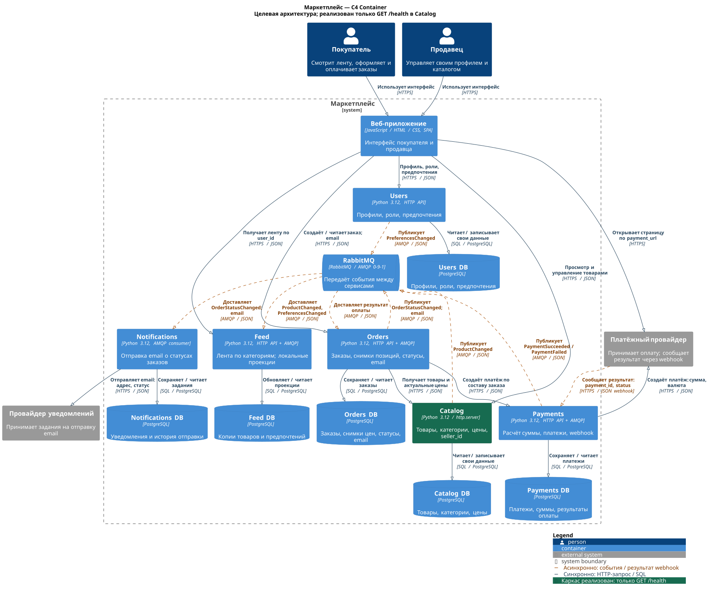

# Архитектура маркетплейса

Я спроектировал маркетплейс, в котором продавцы размещают товары, а покупатели смотрят ленту, оформляют и оплачивают заказы. Архитектуру разделил на шесть сервисов. В коде пока есть только каркас Catalog с `/health`, как и требуется на этом этапе. Остальная бизнес-логика не реализована.

<a id="assumptions"></a>
## 1. Основные решения

- Персонализация простая: пользователь выбирает категории, Feed показывает товары из них. Без предпочтений будет общая лента.
- Один пользователь может быть покупателем и продавцом. Продавец управляет своими товарами.
- Каждый сервис владеет своей базой PostgreSQL. Для событий используется RabbitMQ, для прямых запросов — HTTP API.
- Orders сохраняет названия и цены товаров на момент оформления. Payments считает сумму по этим сохранённым позициям. Валюта одна — RUB, суммы хранятся в целых копейках.
- Уведомления отправляются по email. Покупатель указывает адрес при оформлении, Orders сохраняет его в заказе и передаёт в событии статуса.
- Склады, доставка, промокоды и возвраты в эту работу не входят.

<a id="c4"></a>
## 2. C4 Container



[Открыть диаграмму крупнее](docs/marketplace_containers.svg)

Файл `marketplace_containers.svg` сгенерирован с помощью Codex через PlantUML.

Внутри границы «Маркетплейс» находятся веб-приложение, шесть сервисов, их базы и RabbitMQ. Снаружи — покупатель, продавец, платёжный провайдер и провайдер уведомлений. На диаграмме указаны технологии, назначение контейнеров и направления связей.

Сплошные синие стрелки — синхронные запросы. Оранжевый пунктир — события и результат оплаты через webhook. Зелёным выделен Catalog, для которого написан каркас. Описанная на схеме работа с товарами пока не реализована.

<a id="domains"></a>
## 3. Домены, сервисы и данные

Я выбрал один сервис на каждый домен.

| Домен → сервис | За что отвечает | Своя база и данные | Почему отдельно |
|---|---|---|---|
| Пользователи → **Users** | Профили покупателей и продавцов, роли и предпочтения. Товары и заказы сюда не относятся. | **Users DB:** профили, роли, выбранные категории. | Правила пользователей нужны в разных частях системы, их удобно держать в одном месте. |
| Каталог → **Catalog** | Товары, категории, описания, актуальные цены и принадлежность продавцу. Не меняет уже оформленные заказы. | **Catalog DB:** товары, категории, цены, `seller_id`. | Каталог можно развивать отдельно от правил заказов и оплаты. |
| Лента → **Feed** | Общая и персонализированная лента. Не изменяет исходные товары и профили. | **Feed DB:** копии нужных данных о товарах и предпочтениях пользователей. | Ленту можно отдельно масштабировать и менять порядок выдачи, не запрашивая Catalog при каждом просмотре. |
| Заказы → **Orders** | Заказы, позиции и статусы. Результат оплаты получает от Payments. | **Orders DB:** заказы, снимки названий и цен, количества, `buyer_id`, email, статусы. | Все правила заказа и его сохранённый состав находятся в одном сервисе. |
| Платежи → **Payments** | Расчёт суммы по позициям заказа, создание и учёт платежей, работа с провайдером. Не меняет состав заказа. | **Payments DB:** платежи, `order_id`, суммы, валюта, результаты оплаты и ID платежа у провайдера. | Платёжную интеграцию можно менять независимо от каталога и ленты. |
| Уведомления → **Notifications** | Отправка писем о статусах заказов. Статус самого заказа не меняет. | **Notifications DB:** уведомления, адреса из событий и история отправки. | Проблемы с отправкой письма не должны мешать оформлению и оплате. |

<a id="ownership"></a>
### Границы владения данными

У каждого сервиса отдельная база PostgreSQL и доступ только к своим таблицам. Разделяемых баз нет. Для обращения к данным другого сервиса используются API или события. Ссылки на чужие сущности хранятся как идентификаторы, без внешних ключей между базами.

Catalog хранит исходные данные о товарах, Users — о пользователях. Feed получает события и обновляет свои копии. Такие копии называются проекциями: они нужны для чтения и могут немного отставать от источника.

Снимок заказа сохраняется без последующего обновления цены. Если товар стоил 1000 рублей при оформлении, а потом подорожал до 1200, старый заказ остаётся на 1000 рублей за штуку. Payments считает сумму как цену из снимка, умноженную на количество, и складывает результаты по всем позициям.

<a id="interactions"></a>
## 4. Взаимодействия

Все связи ниже относятся к спроектированной системе. В коде пока есть только `/health`.

| Кто с кем общается | Для чего | Протокол | Тип связи |
|---|---|---|---|
| Покупатель / продавец → Веб-приложение | Использование интерфейса | HTTPS | Синхронная |
| Веб-приложение → Users | Профиль, роли и выбранные категории | HTTPS / JSON | Синхронная |
| Веб-приложение → Catalog | Просмотр товаров и управление каталогом продавца | HTTPS / JSON | Синхронная |
| Веб-приложение → Feed | Получение ленты по `user_id` | HTTPS / JSON | Синхронная |
| Веб-приложение → Orders | Создание заказа из товаров и количеств, передача email, просмотр статуса | HTTPS / JSON | Синхронная |
| Веб-приложение → Платёжный провайдер | Открытие страницы по `payment_url` | HTTPS | Синхронная навигация |
| Orders → Catalog | Получение товаров и актуальных цен перед оформлением | HTTPS / JSON | Синхронная |
| Orders → Payments | Создание платежа по сохранённому составу заказа | HTTPS / JSON | Синхронная |
| Payments → Платёжный провайдер | Создание платежа: сумма, валюта и ID | HTTPS / JSON | Синхронная |
| Платёжный провайдер → Payments | Результат оплаты: ID платежа и статус | HTTPS / JSON webhook | Асинхронная относительно создания платежа |
| Catalog → RabbitMQ → Feed | `ProductChanged`: изменившиеся данные товара | AMQP / JSON | Асинхронная |
| Users → RabbitMQ → Feed | `PreferencesChanged`: выбранные категории пользователя | AMQP / JSON | Асинхронная |
| Payments → RabbitMQ → Orders | `PaymentSucceeded` или `PaymentFailed`: результат оплаты заказа | AMQP / JSON | Асинхронная |
| Orders → RabbitMQ → Notifications | `OrderStatusChanged`: статус заказа и email | AMQP / JSON | Асинхронная |
| Notifications → Провайдер уведомлений | Отправка email о статусе заказа | HTTPS / JSON | Синхронный запрос; доставка письма происходит позже |
| Каждый сервис → Своя база | Чтение и сохранение принадлежащих сервису данных | SQL / PostgreSQL | Синхронная |

При синхронном запросе сервис ждёт ответ. При обмене событиями сообщение передаётся через брокер, и получатель обрабатывает его отдельно. Webhook тоже использует HTTP-запрос и ответ, но сообщает результат оплаты позже первоначального запроса создания платежа.

Веб-приложение не вызывает Payments напрямую: платёж создаётся через Orders. Notifications получает email из события и не обращается за ним в Users.

<a id="scenario"></a>
### Пример покупки

1. Покупатель выбирает товары в Feed и отправляет заказ в Orders.
2. Orders получает актуальные цены из Catalog и сохраняет позиции со статусом `PENDING_PAYMENT`.
3. Payments считает сумму по этим позициям и создаёт платёж у провайдера. Покупатель открывает страницу оплаты.
4. Провайдер сообщает результат через webhook. Payments отправляет событие через RabbitMQ, и Orders меняет статус на `PAID` или `PAYMENT_FAILED`.
5. Orders публикует событие нового статуса. Notifications получает его и отправляет письмо на email из заказа.

Возвращение покупателя со страницы оплаты само по себе не подтверждает платёж. Нужен результат от провайдера.

<a id="alternatives"></a>
## 5. Варианты архитектуры и выбор

**Вариант A — модульный монолит.** Одно backend-приложение с внутренними модулями Users, Catalog, Feed, Orders, Payments и Notifications. Для этого варианта можно использовать одну базу, закрепив таблицы за модулями.

**Вариант B — шесть отдельных сервисов.** Каждый сервис имеет свою базу и общается с остальными через HTTP и RabbitMQ. Именно этот вариант показан на диаграмме.

| Аспект | A — модульный монолит | B — отдельные сервисы |
|---|---|---|
| Разработка и локальный запуск | Один процесс и одна база, проще запустить и отладить. При этом нужно следить за границами модулей. | Больше процессов и настроек, нужно согласовывать API. Полный стенд сложнее нынешнего запуска одного Catalog. |
| Развёртывание | Один артефакт и общий релиз. Изменение одного модуля требует проверки всего приложения. | Сервисы можно выпускать отдельно, но нужно сохранять совместимость API и событий. |
| Масштабирование | Масштабируется всё приложение, даже если нагрузка выросла только на ленту. | Можно отдельно добавить ресурсы Feed или Payments. При этом инфраструктуры становится больше. |
| Данные и транзакции | Проще провести общую транзакцию в одной базе. Общая схема может слишком сильно связать модули. | У каждого сервиса своя транзакция и данные. Между сервисами изменения доходят с задержкой, общей транзакции заказа и платежа нет. |
| Сетевые сбои | Внутренние вызовы идут в одном процессе. Внешние провайдеры всё равно могут быть недоступны, а падение приложения затронет все модули. | Сбой одного сервиса может не остановить остальные, но сетевых зависимостей больше и их недоступность нужно обрабатывать. |
| Сопровождение | Проще смотреть логи и искать ошибку. Один нагруженный модуль может мешать всему процессу. | Можно отдельно следить за нагрузкой каждого сервиса, но сложнее искать ошибку по всей цепочке запросов и событий. |

**Я выбрал вариант B.** Предполагаю, что нагрузка на чтение ленты и обработку платежей будет расти по-разному. Отдельные сервисы позволяют независимо масштабировать эти части, менять выдачу и платёжную интеграцию. У каждого сервиса явно определены свои данные.

Это предположение о развитии проекта, а не измеренный прогноз нагрузки. Цена выбора — больше инфраструктуры, сложнее запуск и согласование изменений между сервисами. Для небольшого MVP модульный монолит был бы проще. Само задание не требует микросервисов, поэтому выбор основан на этих компромиссах.

<a id="run"></a>
## 6. Запуск Catalog

Catalog написан на Python 3.12 со стандартной библиотекой `http.server`. Он слушает `0.0.0.0:8080`, отвечает на `GET /health`, а для неизвестного GET-маршрута возвращает 404. Сторонних библиотек, базы, брокера и секретов для запуска не нужно. Авторизация, CRUD и остальные бизнес-функции не реализованы.

Нужны Docker с Compose v2 и свободный порт 8080. Все команды выполняются из корня проекта.

Проверить конфигурацию, собрать и запустить:

```sh
docker compose config
docker compose up --build -d
```

Проверить сервис:

```sh
curl -i http://localhost:8080/health
curl -i http://localhost:8080/does-not-exist
```

Основные поля ответа `/health`:

```http
HTTP/1.0 200 OK
Content-Type: application/json; charset=utf-8
Content-Length: 15

{"status":"ok"}
```

Неизвестный маршрут возвращает `404 Not Found` и JSON `{"error":"not_found"}`.

Посмотреть состояние контейнера, результат healthcheck и логи:

```sh
docker compose ps
docker inspect --format '{{.State.Health.Status}}' "$(docker compose ps -q catalog)"
docker compose logs --tail=100 catalog
```

Healthcheck выполняется через Python внутри контейнера. После успешной проверки ожидается статус `healthy`.

Остановить проект:

```sh
docker compose down
```

Проверка через Docker прошла успешно: конфигурация корректна, образ собирается, контейнер запускается, `/health` возвращает 200 и нужный JSON, неизвестный маршрут — 404, healthcheck показывает `healthy`.
